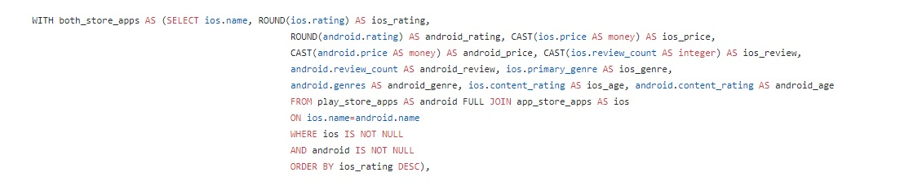
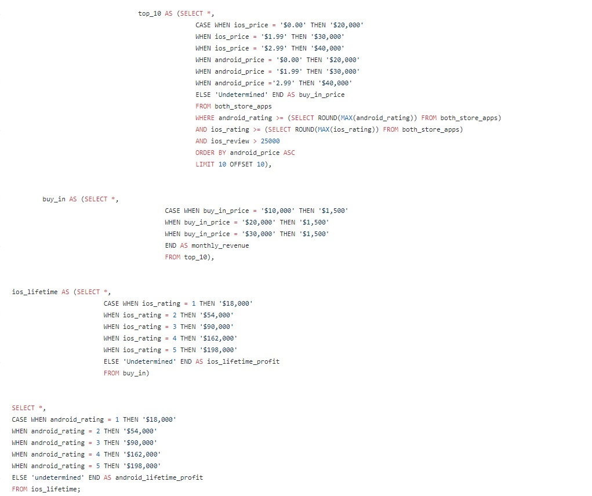
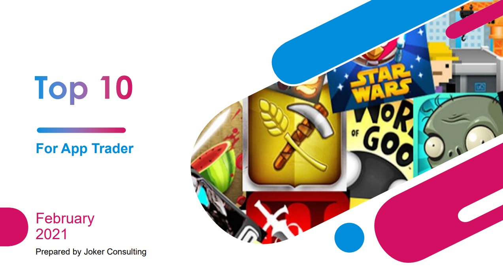
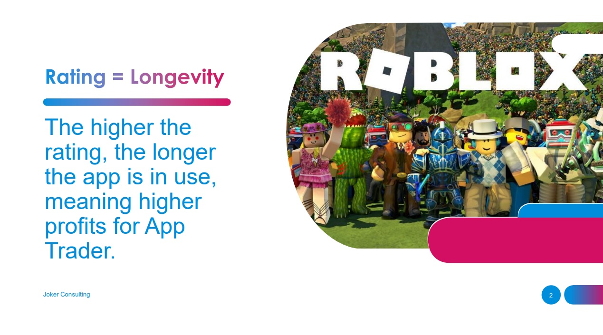
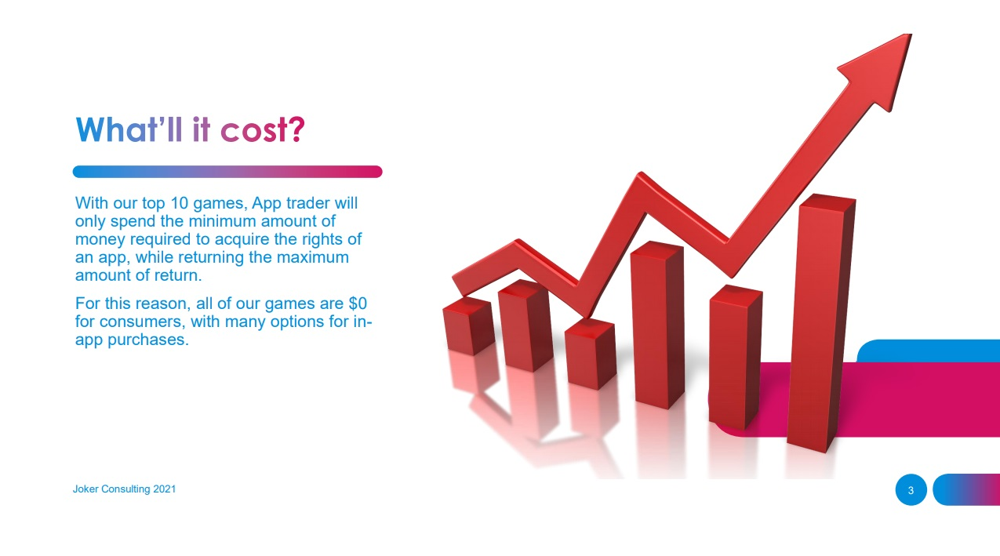
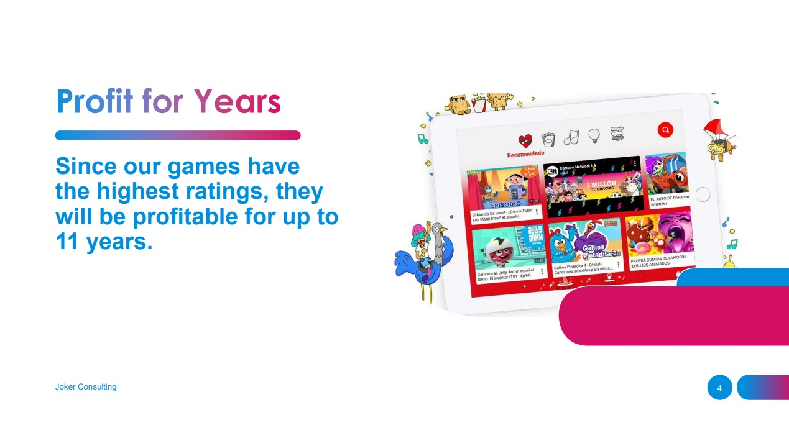
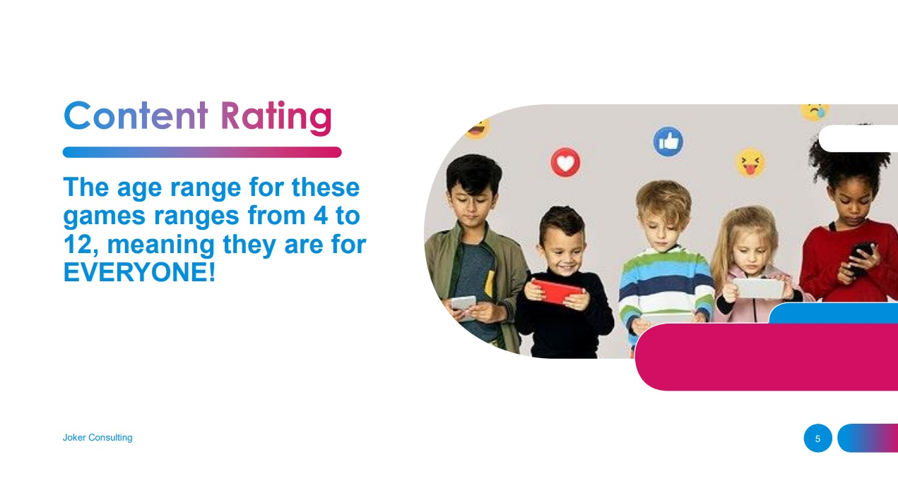
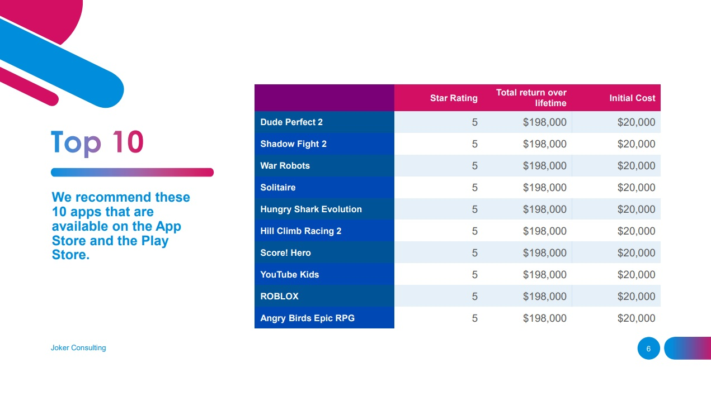

# app-trader-project

# Introduction
Our team was assigned to finding 10 apps to market for a company called App Trader. App Trader is an advertising company that will buy the rights to market apps for a set price per month. App Trader will keep half of the revenue gained from in-app purchases made during the months they market those apps. App Trader wanted apps that were both on the Play Store for Android devices and the App Store for iOS devices so that their advertising costs would be less.

All analysis work was done in PostgreSQL and our team used the query results to create a presentation in PowerPoint. Our team included two "Brandons" including myself.

Data Sources: All data for the project was provided by NSS

# Table of Contents
* [Introduction](#Introduction)
* [SQL Walkthrough](#SQL-Walkthrough)
* [Presentation Walkthrough](#Presentation-Walkthrough)

# SQL Walkthrough
  1. Our team was given two tables containing all of the apps available on both storefronts, which had no table key

  2. We decided to join the tables on the name column and filter through a `FULL JOIN`

  3. As a team, we concluded that of the apps available, the best apps to choose would be entertainment/games available on both the app store and play store with a high star rating, as they are the most popular

  4. We then wrote a list of CTEs to narrow down and clean our output, which gave us our top 10 apps

  

  5. After finding our top 10 apps, our teammate R. Brandon Cantrell created a PowerPoint Presentation to show App Trader our findings

  # Presentation Walkthrough
1. The first slide is an opening slide for the presentation

2. The second slide touches on what considerations our team took when picking our top 10 apps

3. The third slide covers the cost that App Trader will have to pay in order to market the apps chosen

4. The fourth slide presents the profitability of the apps chosen

5. The fifth slide shows the content rating for all of the apps chosen

6. The sixth and final slide is a cost breakdown for each of the top 10 apps

